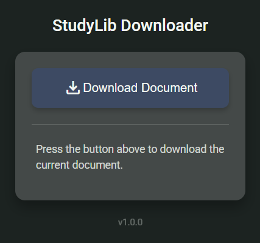

# StudyLib Downloader

A tool that helps you download documents from StudyLib websites for educational purposes only. Available as both a browser extension and a bash script. Please respect copyright laws and the terms of service of StudyLib.



## Browser Extension

### Installation

#### Chrome / Brave
1. Download the [latest release](https://github.com/rh45-one/StudyLib-Downloader/releases/latest) and extract it
2. Open Chrome and navigate to `chrome://extensions/`
3. Enable "Developer mode" in the top-right corner
4. Click "Load unpacked" and select the `StudyLib-Downloader-Extension` folder
5. The extension should now appear in your browser toolbar

#### Firefox
1. Download the [latest release](https://github.com/rh45-one/StudyLib-Downloader/releases/latest) and extract it
2. Open Firefox and navigate to `about:debugging#/runtime/this-firefox`
3. Click "Load Temporary Add-on" and select any file in the `StudyLib-Downloader-Extension` folder
4. The extension should now appear in your browser toolbar

### Usage
1. Navigate to any StudyLib document page
2. Click the StudyLib Downloader icon in your browser toolbar
3. Click the "Download Document" button
4. The extension will automatically detect the document and begin the download

## Bash Script Version

### Requirements
- Bash shell
- Node.js (v14+)
- npm

### Installation
1. Download the [latest release](https://github.com/rh45-one/StudyLib-Downloader/releases/latest) and extract the `scraper.sh` script
2. Make it executable: `chmod +x scraper.sh`

### Usage
```bash
./StudyLib-Downloader-Bash.sh <StudyLib-URL>
```

## How It Works (Manual Process)

The tools in this repository automate what could be done manually. Here's how the document extraction process works:

### Technical Explanation

StudyLib documents are displayed in embedded document viewers. The actual document URL is hidden within the page. Here's how to find and download documents manually:

1. **Find the document viewer URL**:
   - Open a StudyLib document page
   - Right-click and select "View Page Source" (or press Ctrl+U)
   - Search (Ctrl+F) for `viewer_next/web/study`
   - You should find a URL that contains this pattern, often within an iframe or JavaScript code
   
2. **Alternative method - using Developer Tools**:
   - Open Developer Tools (F12 or Ctrl+Shift+I)
   - Go to the "Network" tab
   - Reload the page (F5)
   - Filter requests by typing `viewer` in the filter box
   - Look for requests containing `viewer_next/web/study`
   
3. **Access the document viewer directly**:
   - Copy the complete URL you found
   - Open it in a new tab
   - This will take you to the document viewer page
   
4. **Download the document**:
   - In the document viewer, look for the "Download" button (usually in the top-right corner)
   - Click it to start the download
   - The document will download in its original format (usually PDF)
   - If the download button is hidden, run the following command in the developer tools console to emulate a button press: `document.getElementById("download").click();` 

### What the Tools Automate

The extension and bash script automate this process by:
1. Scanning the page for the document viewer URL using multiple detection methods
2. Navigating to the document viewer URL
3. Simulating a click on the download button
4. Handling the download process

This automation saves time and works even on pages where the document viewer is loaded dynamically or hidden in complex JavaScript.

## License

This project is licensed under the Creative Commons Attribution-NonCommercial 4.0 International License (CC BY-NC-SA 4.0) - see the [LICENSE.md](LICENSE.md) file for details.

